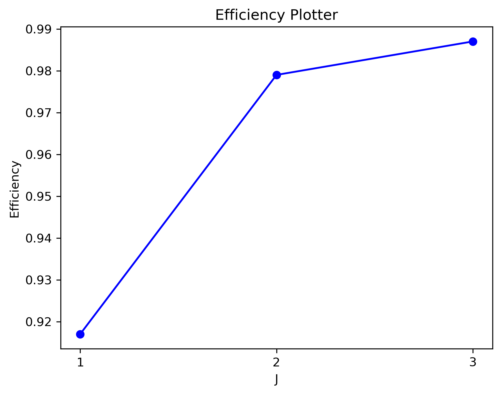

## Assignment-1

| Symbol | Code |
| a1 | 1 |
| a2 | 01 |
| a3 | 00 |

| I | Log |
| Ia1 | 0.9159357352115255 |
| Ia2 | 1.434402824145775 |
| Ia3 | 3.321928094887362 |

$$
 H(x) = I_{a1} \cdot P_{a1} + I_{a2} \cdot P_{a2} + I_{a3} \cdot P_{a3} +  = 0.916 \cdot 0.53+1.434 \cdot 0.37+3.322 \cdot 0.1 = 1.348 
$$ 

H(x) = 1.348

$$
 R(x) = 0.53 \cdot 1 + 0.37 \cdot 2 + 0.1 \cdot 2  = 1.47 
$$ 

R(x) = 1.47

$$
 n = \frac{H(x)}{R} = \frac{1.348}{1.47} = 0.917 = 91.7\ \% 
$$

 n = 0.917 

## Assignment-2

| Combination | Probability |
| a1a1 | 0.281 |
| a1a2 | 0.196 |
| a1a3 | 0.053 |
| a2a1 | 0.196 |
| a2a2 | 0.137 |
| a2a3 | 0.037 |
| a3a1 | 0.053 |
| a3a2 | 0.037 |
| a3a3 | 0.01 |

| Combination | Code |
| a1a1 | 10 | 
| a1a2 | 00 | 
| a1a3 | 11111 | 
| a2a1 | 01 | 
| a2a2 | 110 | 
| a2a3 | 111011 | 
| a3a1 | 11110 | 
| a3a2 | 11100 | 
| a3a3 | 111010 | 

$$
 R(x) = 0.196 \cdot 2 + 0.196 \cdot 2 + 0.281 \cdot 2 + 0.137 \cdot 3 + 0.037 \cdot 5 + 0.01 \cdot 6 + 0.037 \cdot 6 + 0.053 \cdot 5 + 0.053 \cdot 5  = 2.754 
$$ 

R(x) = 2.754

$$
 H(x) = 2 H(x) = 2 \cdot 1.348 = 2.696 
$$

H(x) = 2.696

$$
 n = \frac{2H(x)}{R} = \frac{2.696}{2.754} = 0.979 = 97.89999999999999\ \% 
$$

 n = 0.979 

| Combination | Probability |
| a1a1a1 | 0.149 |
| a1a1a2 | 0.104 |
| a1a1a3 | 0.028 |
| a1a2a1 | 0.104 |
| a1a2a2 | 0.073 |
| a1a2a3 | 0.02 |
| a1a3a1 | 0.028 |
| a1a3a2 | 0.02 |
| a1a3a3 | 0.005 |
| a2a1a1 | 0.104 |
| a2a1a2 | 0.073 |
| a2a1a3 | 0.02 |
| a2a2a1 | 0.073 |
| a2a2a2 | 0.051 |
| a2a2a3 | 0.014 |
| a2a3a1 | 0.02 |
| a2a3a2 | 0.014 |
| a2a3a3 | 0.004 |
| a3a1a1 | 0.028 |
| a3a1a2 | 0.02 |
| a3a1a3 | 0.005 |
| a3a2a1 | 0.02 |
| a3a2a2 | 0.014 |
| a3a2a3 | 0.004 |
| a3a3a1 | 0.005 |
| a3a3a2 | 0.004 |
| a3a3a3 | 0.001 |

| Combination | Code |
| a1a1a1 | 110 | 
| a1a1a2 | 001 | 
| a1a1a3 | 01111 | 
| a1a2a1 | 000 | 
| a1a2a2 | 1010 | 
| a1a2a3 | 111010 | 
| a1a3a1 | 01110 | 
| a1a3a2 | 111101 | 
| a1a3a3 | 11111101 | 
| a2a1a1 | 010 | 
| a2a1a2 | 1001 | 
| a2a1a3 | 111001 | 
| a2a2a1 | 1011 | 
| a2a2a2 | 0110 | 
| a2a2a3 | 1111111 | 
| a2a3a1 | 111110 | 
| a2a3a2 | 100001 | 
| a2a3a3 | 11100001 | 
| a3a1a1 | 10001 | 
| a3a1a2 | 111100 | 
| a3a1a3 | 11111100 | 
| a3a2a1 | 111011 | 
| a3a2a2 | 100000 | 
| a3a2a3 | 11100000 | 
| a3a3a1 | 11100010 | 
| a3a3a2 | 111000111 | 
| a3a3a3 | 111000110 | 

$$
 R(x) = 0.104 \cdot 3 + 0.104 \cdot 3 + 0.104 \cdot 3 + 0.051 \cdot 4 + 0.028 \cdot 5 + 0.028 \cdot 5 + 0.014 \cdot 6 + 0.014 \cdot 6 + 0.028 \cdot 5 + 0.073 \cdot 4 + 0.073 \cdot 4 + 0.073 \cdot 4 + 0.149 \cdot 3 + 0.004 \cdot 8 + 0.004 \cdot 8 + 0.005 \cdot 8 + 0.001 \cdot 9 + 0.004 \cdot 9 + 0.02 \cdot 6 + 0.02 \cdot 6 + 0.02 \cdot 6 + 0.02 \cdot 6 + 0.02 \cdot 6 + 0.02 \cdot 6 + 0.005 \cdot 8 + 0.005 \cdot 8 + 0.014 \cdot 7  = 4.098 
$$ 

R(x) = 4.098

$$
 H(x) = 3 H(x) = 2 \cdot 1.348 = 2.696 
$$

H(x) = 2.696

$$
 n = \frac{3H(x)}{R} = \frac{4.0440000000000005}{4.098} = 0.987 = 98.7\ \% 
$$

 n = 0.987 

